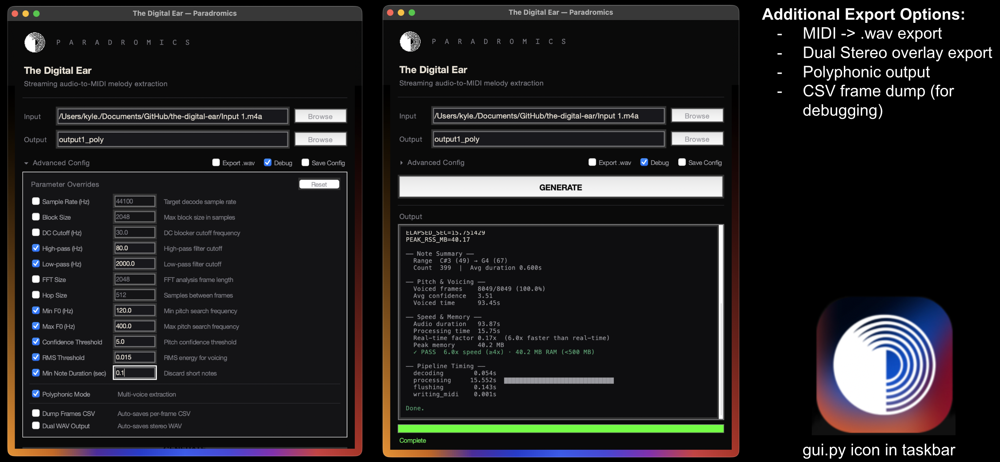

# The Digital Ear

A streaming audio-to-MIDI extraction pipeline built for [Paradromics](https://paradromics.com) Qualifier. Turns a raw audio signal into discrete MIDI note events using harmonic analysis, source separation, and an online Viterbi decoder — all running in constant memory on a single thread.

## [In-Depth Architecture Walkthrough (Google Slides)](https://docs.google.com/presentation/d/1e4HgQPgvp3ZzGGHwky6CwUFruW1vtq-2nBTBd-b3gio/edit?usp=sharing)

> **[Watch the Demo (YouTube)](https://youtu.be/-NZO0LaA_Zs)**



---

## How it works

```
Audio in → Preprocess → HPSS → Pitch Detection → Viterbi → Note Tracking → MIDI out
```

Each stage is streaming. Each stage has bounded memory. Audio goes in one end as 2048-sample blocks, MIDI notes come out the other.

### The pipeline

**Preprocessing** — DC blocker, high-pass at 60 Hz, low-pass at 4 kHz. Three cascaded 1-pole IIR filters. Removes rumble and high-frequency harmonics that confuse pitch detection.

**HPSS (Harmonic-Percussive Source Separation)** — Median filtering on a sliding STFT buffer. Separates the tonal content (voice, guitar, piano) from transients (drums, clicks, plucks). The pitch detector only sees the harmonic stream. Based on [Fitzgerald, DAFx 2010].

**Pitch Detection** — MELODIA-style harmonic salience function. Builds a log-frequency salience map (10-cent resolution), sums energy across harmonics with cos² spreading, applies A-weighting, and extracts the top candidates with confidence scores. Derived from [Salamon & Gomez, IEEE 2012].

**Online Viterbi** — Fixed-lag HMM decoder that picks the best pitch candidate at each frame while enforcing temporal continuity. The transition and emission costs adapt in real time based on two causal estimates:
- *Tonality* (0.5s lookback) — how tonal vs. noisy the signal is right now
- *Voicing density* (10s lookback) — what fraction of recent frames had pitch candidates

This density-adaptive behavior is custom — not from any paper. It lets the decoder tighten up during clean melodic passages and loosen during noisy sections, without any manual threshold tuning.

**Note Tracking** — Median smoothing, f0-to-MIDI quantization, run-length encoding, minimum duration gating (120 ms), fragment merging, and octave correction. Converts the raw frame-by-frame pitch stream into clean note-on/note-off events.

### Pipeline numbers

| Metric | Value |
|---|---|
| Total latency | ~753 ms (audio in → MIDI decision) |
| Memory (constant) | ~31 MB regardless of audio length |
| Real-time factor | 10-20x faster than real-time on laptop |
| Block size | 2048 samples (46 ms at 44.1 kHz) |
| Viterbi lag | 50 frames (~580 ms) |

---

## Quick start

### Requirements

- Python 3.7+
- NumPy
- ffmpeg (on your PATH)
- tkinter (included with Python on most systems)

```bash
pip install numpy psutil
```

That's it. No scipy, no librosa, no tensorflow.

### Run the GUI

```bash
python gui.py
```

Pick an input file, hit Generate. The output MIDI lands in `outputs/`.

### Run from the command line

```bash
# Basic — extract melody to MIDI
python main.py --in "song.m4a" --out output.mid

# With debug stats
python main.py --in "song.m4a" --out output.mid --debug

# Export a side-by-side WAV (original left, synth right)
python main.py --in "song.m4a" --out output.mid --dual output_dual.wav

# Polyphonic mode (extracts up to 3 voices)
python main.py --in "song.m4a" --out output.mid --poly

# GUI usage to easily exapnded functions
python gui.py
```

### CLI options

| Flag | Default | What it does |
|---|---|---|
| `--in` | *(required)* | Input audio file (.m4a, .wav, .mp3, .flac, .ogg) |
| `--out` | *(required)* | Output MIDI file path |
| `--sr` | 44100 | Sample rate |
| `--fmin` | 80 | Lowest pitch to detect (Hz) |
| `--fmax` | 1000 | Highest pitch to detect (Hz) |
| `--conf-th` | 7.0 | Pitch confidence threshold |
| `--debug` | off | Print timing, memory, voicing stats |
| `--poly` | off | Polyphonic extraction (3 voices) |
| `--wav` | — | Also export a synthesized WAV |
| `--dual` | — | Stereo WAV: original + synth side by side |
| `--dump-frames` | — | CSV with per-frame pitch/confidence/RMS |

---

## Project structure

```
the-digital-ear/
├── main.py                     # CLI entry point
├── gui.py                      # Tkinter GUI
│
├── digital_ear/
│   ├── audio_io.py             # ffmpeg streaming decoder
│   ├── preprocess.py           # DC block, HPF, LPF (1-pole IIR)
│   ├── hpss.py                 # Harmonic-Percussive Source Separation
│   ├── features.py             # Frame extraction
│   ├── harmonic_pitch.py       # MELODIA-style pitch salience
│   ├── melody_extractor.py     # Online Viterbi decoder
│   ├── note_tracker.py         # f0 stream → MIDI note events
│   ├── midi_writer.py          # Raw binary MIDI writer (no deps)
│   └── perf.py                 # Performance/memory profiler
│
├── other/                      # Test scripts, spectrogram generation, etc.
│
└── outputs/                    # Generated MIDI, WAV, spectrograms
└── other                       # Test scripts, misc files
```

---

## Papers this builds on

| Problem | Paper | What we took |
|---|---|---|
| Percussion bleeds into pitch | Fitzgerald, DAFx 2010 | HPSS via median filtering |
| Pitch ambiguity / harmonics | Salamon & Gomez, IEEE 2012 | Harmonic salience function |
| Frame-to-frame pitch flicker | Mauch & Dixon, ICASSP 2014 | HMM + Viterbi smoothing |
| Static parameters fail on mixed audio | *(custom)* | Density-adaptive transition/emission costs |

---

---

<br>

# GhostFM — Stage 2: Hardware Build

<p align="center">
  
  
</p>

A standalone embedded device that receives live FM radio, extracts the dominant melody in real time using the Digital Ear pipeline, and re-synthesizes it as a ghostly detuned tone. Runs headless on a Raspberry Pi 5.

> **[Watch the demo (YouTube)](https://youtu.be/-NZO0LaA_Zs)** · **[Technical Report (PDF)](https://docs.google.com/document/d/1ybPdFV4gEjY_bk80InmQOk2rB1dyYgd1dkJyzeynH10/edit?usp=sharing)**

---

## Signal Flow

```
FM Broadcast → RTL-SDR → rtl_fm (demod) → Digital Ear Pipeline → GhostSynth → USB DAC → Speaker
                           S16LE @ 44.1k    (same as Stage 1)     3 detuned
                                                                  oscillators
```

The Digital Ear pipeline runs unchanged from Stage 1. GhostFM wraps it in a threaded architecture with live FM input and real-time audio synthesis.

---

## Hardware Required

| Part | Purpose |
|---|---|
| Raspberry Pi 5 (4GB) | Runs the pipeline headless |
| RTL-SDR Blog V4 + Dipole Antenna | FM radio reception (88–108 MHz) |
| USB Audio Adapter (DAC) | Audio output to speaker |
| Speaker | Plays the synthesized melody |
| Waveshare 1.3" LCD HAT | Status display + physical controls |
| RPi 27W USB-C Power Supply | Powers the Pi |

Full BOM with prices in the [Technical Report](technical_report/ghostfm_technical_report.pdf). Total: **$222 / $250 budget**.

---

## Quick Start

### Requirements

Everything from Stage 1, plus:

```bash
pip install sounddevice gpiozero lgpio
sudo apt install rtl-sdr
```

### Run

```bash
# Basic — tune to 89.9 FM
python ghost_fm.py --freq 89.9M

# Specify audio output device
python ghost_fm.py --freq 89.9M --output-device 2

# List available audio devices
python ghost_fm.py --list-devices

# Adjust LCD brightness (0-100, default 50)
python ghost_fm.py --freq 89.9M --brightness 40
```

### Physical Controls (LCD HAT, mounted upside-down)

| Control | Action |
|---|---|
| Joystick Up/Down | Confidence threshold ↑↓ |
| Joystick Left/Right | Noise gate ↑↓ |
| Joystick Press (short) | Mute / unmute |
| Joystick Press (hold 1s) | Reset conf & gate to defaults |
| KEY3 (top) | Cycle FM station preset |
| KEY2 (middle) | Toggle Ghost / Radio mode |
| KEY1 (bottom, short) | Pause / unpause |
| KEY1 (bottom, hold 3s) | Quit (only when paused) |

### Autostart on Boot

```bash
sudo cp ghostfm.service /etc/systemd/system/
sudo systemctl daemon-reload
sudo systemctl enable ghostfm
sudo systemctl start ghostfm
```

---

## GhostFM Files

```
the-digital-ear/
├── ghost_fm.py              # Main entry point (FM reader, pipeline, synth, controls)
├── ghost_display.py         # LCD HAT driver + retro UI (ST7789, direct SPI)
├── ghostfm.service          # systemd unit file for autostart
├── assets/
│   ├── ghost.png            # Ghost sprite for LCD idle animation
│   └── ghostfm_purple.png   # Logo for LCD display
└── technical_report/        # PDF technical report
```

---

## License

Internal project for Paradromics. Not currently open-sourced.
